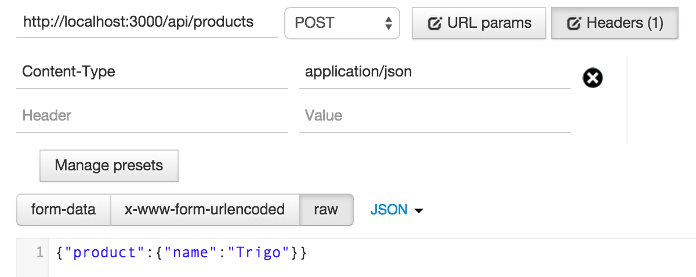

# Lista de Compras

Lista de compras é um aplicativo desenvolvido para o aprendizado de Ruby on Rails e AngularJS.

## 1. Criando a aplicação Rails

 <small>Mais em: http://guides.rubyonrails.org/getting_started.html</small>

Para criar a aplicação execute o comando abaixo:

    rails new lista_de_compras --skip-turbolinks --skip-test-unit --skip-bundle

> Não usaremos o turbolinks, nem o testunit e não iremos rodar o bundle antes de ajustar o Gemfile.

Acesse a pasta do aplicativo:

    cd lista_de_compras

## 2. Alterando o Gemfile
Vamos remover algumas Gems que não fazem sentido pro nosso projeto. Deixe o seu Gemfile como o mostrado abaixo:

    source 'https://rubygems.org'

    gem 'rails', '4.2.0'
    gem 'sqlite3'
    gem 'sass-rails', '~> 5.0'
    gem 'uglifier', '>= 1.3.0'

    group :development, :test do
      gem 'byebug'
      gem 'web-console', '~> 2.0'
      gem 'spring'
    end

## 3. Baixando as Gems

Após selecionar as Gems que iremos utilizar acionamos o Bundler para instalá-las

    bundle install
 <small>Mais em: http://bundler.io</small>

## 4. Versionando

    git init
    git add .
    git commit -m "Initial commit"

 <small>Mais em: http://git-scm.com</small>

## 5. Checando se está tudo certo

Vamos iniciar o servidor pra checar se a aplicação está belezinha:

    bin/rails s

Acesse o navegador no endeço http://localhost:3000. Você ver a página inicial de um projeto Rails.

 <small>Mais em: http://guides.rubyonrails.org/command_line.html#rails-server</small>

## 6. Criando o primeiro Model

    bin/rails g model Product name:string

 <small>Mais em: http://guides.rubyonrails.org/active_record_migrations.html</small>

## 7. Rodando as migrações

    bin/rake db:migrate

 <small>Mais em: http://guides.rubyonrails.org/active_record_migrations.html#running-migrations</small>

 `git add ."`

 `git commit -m "Create Product's model."`

## 8. Criando a rota para o recurso Products

Altere o arvivo **config/routes.rb** como o exemplo abaixo:

    Rails.application.routes.draw do
      namespace :api do
        resources :products
      end
    end

Após criar teste a rota através do console:

    bin/rake routes

 <small>Mais em: http://guides.rubyonrails.org/routing.html</small>

 `git commit -am "Configure Product at routes' file."`

## 9. Criando o controlador de Products

Iremos criar o controlador de produtos sem view, por isso passamos alguns parâmetros para que o gerador não crie arquivos de helper, css e js.  

    bin/rails g controller api/products --no-helper --no-assets --no-template-engine

 <small>Mais em: http://guides.rubyonrails.org/getting_started.html#generating-a-controller</small>

 `git add ."`

 `git commit -m "Create Product's controller."`

## 10. Adicionando a action index no controlador Products

Abra o arquivo **app/controllers/api/products_controller** e modifique como abaixo:

    class Api::ProductsController < ApplicationController
      def index
        render plain: "Olá"
      end
    end

Uma dica bacana é abrir o browser e acessar a URL [http://localhost:3000/api/products] e ver o resultado.

Depois:

    class Api::ProductsController < ApplicationController
      def index
        render html: "<h1>Olá</h1>".html_safe
      end
    end

Refresh no browser :wink:.

Teste agora em JSON:

      class Api::ProductsController < ApplicationController
        def index
          render json: "{product: {id: 1, name: 'Sabonete'}}"
        end
      end  

Refresh no browser :wink:.

E que tal XML?

    class Api::ProductsController < ApplicationController
      def index
        render xml: "<product><id>1</id><name>Sabonete</name></product>"
      end
    end  

Não esqueça, refresh no browser :wink:

 <small>Mais em: http://guides.rubyonrails.org/action_controller_overview.html</small>  

## 11. Respondendo JSON do model Products

Agora altere para o controlador para responder JSON:

    class Api::ProductsController < ApplicationController
      def index
        render json: Product.all
      end
    end

Teste! Retornou um array vazio, certo? É porque falta incluirmos alguns produtos. Abra o Rails Console e cadastre alguns. Siga o exemplo abaixo:

    bin/rails c
    Product.create(name: "Arroz")
    Product.create(name: "Feijão")

Faça o refresh no browser e veja o JSON gerado.

 `git commit -am "Create action index at ProductsController."`

## 12. Utilizando o ActiveModelSerializer

Adicione a gem no Gemfile

    gem 'active_model_serializers', '0.9.3'

No console rode o Bundler

    bundle install

## 13. Criando um Serializer pra Products

Rode o comando no console:

    bin/rails g serializer product

Modifique o arquivo **app/serializers/product_serializer.rb** conforme abaixo:

    class ProductSerializer < ActiveModel::Serializer
      attributes :id, :name
    end

Faça o refresh no browser e veja o JSON gerado.

 <small>Mais em: https://github.com/rails-api/active_model_serializers</small>

 `git add ."`

 `git commit -m "Create Product's serializer."`

## 14. Implementando as outras actions do controller

    class Api::ProductsController < ApplicationController
      def index
        render json: Product.all
      end

      def new
        render json: Product.new
      end

      def show
        render json: Product.find(params[:id])
      end

      def create
        product = Product.new(filtered_params)

        if product.save
          render json: product, status: :created
        else
          render json: product.errors, status: :unprocessable_entity
        end
      end

      def update
        product = Product.find(params[:id])

        if product.update(filtered_params)
          render json: product
        else
          render json: product.errors, status: :unprocessable_entity
        end
      end

      def destroy
        product = Product.find(params[:id])

        if product.destroy
          render json: product
        else
          render json: product.errors, status: :unprocessable_entity
        end
      end

      private

      def filtered_params
        params.require(:product).permit(:name)
      end
    end

 `git commit -am "Create all actions at ProductsController."`

## 15. Testando com o Postman

### 15.1. Instalando
Iremos testar os endpoints da nossa API através do Postman. Baixe a extensão Postman do Chrome em: https://chrome.google.com/webstore/detail/postman-rest-client/fdmmgilgnpjigdojojpjoooidkmcomcm

### 15.2. Permitindo requisições sem token

Adicione a seguinte linha em **ProductsController**

    class Api::ProductsController < ApplicationController
      protect_from_forgery except: [:create, :update, :destroy]

Isso fará com que o Rails aceite requisições sem o token de autenticidade.

>**NÃO ESQUECA DE DESFAZER ISSO APÓS TESTAR SUA API**

 <small>Mais em: http://edgeguides.rubyonrails.org/security.html</small>

### 15.3. Testando

Agora é só testar as actions. Utilize a imagem abaixo como modelo pra POST, PUT/PATCH e DELETE:

## 16. Criando o recurso List

### 16.1. Criando o model de List

    bin/rails g model List name:string
    bin/rake db:migrate

### 16.2. Configurando as rotas

Altere o arvivo **config/routes.rb** para adicionar o novo recurso. Siga o exemplo abaixo:

    resources :lists

 `git add .`

 `git commit -m "Create List's model."`

### 16.3. Criando o model de ListItem

Neste model iremos referenciar os outros dois (List e Product). Após a geração da migration será necessário alguns ajustes.

    bin/rails g model ListItem list:references product:references quantity:integer

Ajustando a migration. Note que as instruções para adição das chaves estrangeiras foram movidas para outra *Migration*. Isso é recomendado porque existem situações em que a tabela é criada e a foreing key não devido a algum problema. Quando isso ocorre não é possível desfazer a migração já que ela não rodou e também não é possível rodar-la novamente, já que a tabela já foi criada. Por isso lembre-se sempre de tornar suas migrações atômicas.  

    class CreateListItems < ActiveRecord::Migration
      def change
        create_table :list_items do |t|
          t.references :list, index: true, null: false
          t.references :product, index: true, null: false
          t.integer :quantity

          t.timestamps null: false
        end
      end
    end

Rode a migration

    bin/rake db:migrate

### 16.4. Adicionando as chaves estrangeiras em ListItem

Adicione a chave estrangeira para List. Rode o comando abaixo para criar uma migration.

    bin/rails g migration AddListRefToListItems

Agora edite a migration:

    class AddListRefToListItems < ActiveRecord::Migration
      def change
        add_foreign_key :list_items, :lists
      end
    end

Rode a migration:

    bin/rake db:migrate

Adicionando a chave estrangeira para Product.

    bin/rails g migration AddProductRefToListItems

Agora edite a migration:

    class AddProductRefToListItems < ActiveRecord::Migration
      def change
        add_foreign_key :list_items, :products
      end
    end

Rode a migration

    bin/rake db:migrate

 `git add .`

 `git commit -m "Create ListItem's model."`

### 16.4. Ajustando os Models

Altere o model de Product conforme abaixo:

    class Product < ActiveRecord::Base
      has_many :list_items
    end

Abra o model de ListItem e dê uma olhadinha:

    class ListItem < ActiveRecord::Base
      belongs_to :list
      belongs_to :product
    end

 <small>Mais em: http://guides.rubyonrails.org/association_basics.html</small>

Altere o model de List conforme abaixo:

    class List < ActiveRecord::Base
      has_many :list_items, dependent: :destroy
      accepts_nested_attributes_for :list_items, allow_destroy: true
    end

 <small>Mais em: http://api.rubyonrails.org/classes/ActiveRecord/NestedAttributes/ClassMethods.html</small>

 `git add .`

 `git commit -m "Ajust associations between models."`

## 17. Criando o controller para List

O controller para List é muito similar ao de Product. O que vai mudar basicamente é o nome do controller e o model. Também será necessário alterar a lista de atributos filtrados na requisições de create e update. Altere como o modelo abaixo:

    def filtered_params
      params.require(:list).permit(:name, list_items_attributes: [:id, :list_id,
        :product_id, :quantity, :_destroy])
    end

 `git add .`

 `git commit -m "Create List's controller."`

## 18. Criando serializers para o recurso List

Crie os seguintes serializers:

Serializer de uma lista de compra:

    class ListSerializer < ActiveModel::Serializer
      attributes :id, :name

      has_many :list_items
    end

***

Serializer de um item da lista de compras:

    class ListItemSerializer < ActiveModel::Serializer
      attributes :id, :quantity

      has_one :product
    end

***

Serializer de várias listas de compra (somente o preview):

    class ListPreviewSerializer < ActiveModel::Serializer
      attributes :id, :name
    end

***

Ajustar a action index de ListsController pra usar o serializer de preview

    class Api::ListsController < ApplicationController
      def index
        render json: List.all, each_serializer: ListPreviewSerializer
      end
    ...

Ufa! Vamos *commitar*?

 `git add .`

 `git commit -m "Create serializers to Lits and ListItems."`

## 19. Testando

Iremos fazer testes de routes, controllers, models e serializers. Pra isso usaremos o RSpec.

### 19.1. Instalando o RSpec e Should-Matchers

Adicione a linha abaixo no grupo desenvolvimento e testes:

    group :development, :test do
      gem 'rspec-rails', '~> 3.0'
      gem 'shoulda-matchers', '2.8.0'
    ...

Rode o bundler

    bundle install

Agora rode o instalador

    bin/rails generate rspec:install

Depois

    bundle binstubs rspec-core

Verifique se está tudo certo, testando no console:

    bin/rspec

O resultado será algo do tipo:

    No examples found.

    Finished in 0.00037 seconds (files took 0.15663 seconds to load)
    0 examples, 0 failures

:ok_hand: é isso aí.

 <small>Mais em: https://github.com/rspec/rspec-rails</small>

 `git add .`

 `git commit -m "Install RSpec."`

### 19.2. Adicionando e removendo alguns arquivos

    git rm app/helpers/application_helper.rb
    git rm app/views/* -r
    git rm app/mailers/.keep
    git rm app/models/.keep
    git rm app/models/concerns/.keep
    git rm app/controllers/concerns/.keep

    mkdir spec/models
    mkdir spec/controllers
    mkdir spec/controllers/api
    mkdir spec/serializers
    mkdir spec/routing
    mkdir spec/routing/api

    touch spec/models/list_spec.rb
    touch spec/models/list_item_spec.rb
    touch spec/models/product_spec.rb

    touch spec/controllers/api/lists_controller_spec.rb
    touch spec/controllers/api/products_controller_spec.rb

    touch spec/routing/api/lists_routing_spec.rb
    touch spec/routing/api/products_routing_spec.rb

    touch spec/serializers/list_item_serializer_spec.rb
    touch spec/serializers/list_preview_serializer_spec.rb
    touch spec/serializers/list_serializer_spec.rb
    touch spec/serializers/product_serializer_spec.rb

 `git add .`

 `git commit -m "Add and remove some files."`

### 19.3. Testando os Models

O Rails possui uma grande lista de validações que você pode definir em seus Models, tais como presença, tamanho, formato, associações, etc. Ao criar um Model é altamente recomendável que você defina as regras de validação do mesmo. Para obter a relação completa de validações acesse o link http://guides.rubyonrails.org/active_record_validations.html.

As validações configuradas nos models podem ser testadas através de uma Gem chamada Should-Matchers (acima incluída no GemFile). A vantagem de usar essa Gem é que com apenas uma linha você testa uma validação aplicada no Model, além de possuir uma linda DSL. A documentação está em https://github.com/thoughtbot/shoulda-matchers.

><small>app/models/product.rb</smal>

    class Product < ActiveRecord::Base
      has_many :list_items

      validates :name, presence: true
    end  

><small>spec/models/produc_spec.rb</smal>

    require "rails_helper"

    RSpec.describe Product, :type => :model do
      it { should validate_presence_of(:name) }

      it { should have_many(:list_items) }
    end

><small>app/models/list.rb</smal>

    class List < ActiveRecord::Base
      has_many :list_items, dependent: :destroy
      accepts_nested_attributes_for :list_items, allow_destroy: true

      validates :name, presence: true
    end

><small>spec/models/list_spec.rb</smal>

    require "rails_helper"

    RSpec.describe List, :type => :model do
      it { should validate_presence_of(:name) }

      it { should have_many(:list_items).dependent(:destroy) }
    end

><small>app/models/list_item.rb</smal>

    class ListItem < ActiveRecord::Base
      belongs_to :list
      belongs_to :product

      validates :quantity, numericality: { only_integer: true }
    end

><small>spec/models/list_item_spec.rb</smal>

    require "rails_helper"

    RSpec.describe ListItem, :type => :model do
      it { should validate_numericality_of(:quantity).only_integer }

      it { should belong_to(:product) }
      it { should belong_to(:list) }
    end

 `git add .`

 `git commit -m "Add tests to models."`

## 20. Próximos passos
* Criar os testes para models, routes, controllers e serializers.

* Implementar *frontend* com AngularJS.
